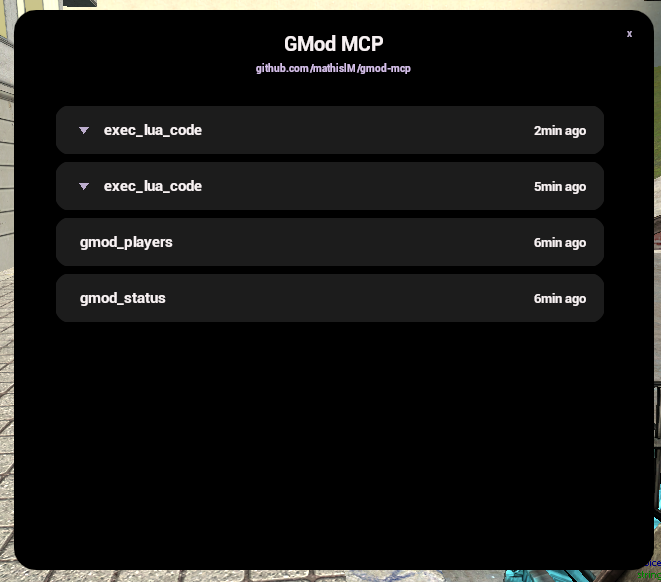
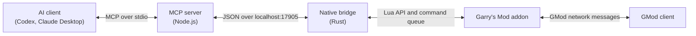

# GMod MCP

## Table of Contents

- [Overview](#overview)
  - [Demo Video](#demo-video)
- [Usage](#usage)
  - [In-Game Menu](#in-game-menu)
- [Installation](#installation)
  - [Prerequisites](#prerequisites)
  - [Automatic Installation](#automatic-installation)
  - [Manual Installation](#manual-installation)
    - [Installing the Addon](#garrys-mod-addon-installation)
    - [Installing the Module](#garrys-mod-module-installation)
    - [Configuring Codex](#configuring-codex)
    - [Configuring Claude Desktop](#configuring-claude-desktop)
    - [Configuring Claude Code](#configuring-claude-code)
- [How It Works](#how-it-works)
- [Development](#development)
  - [Development Prerequisites](#development-prerequisites)
  - [Project Structure](#project-structure)
  - [Setup](#setup)
  - [Available Commands](#available-commands)
  - [Testing Local MCP Changes](#testing-local-mcp-changes)
- [License](#license)

## Overview

GMod MCP connects AI agents to live Garry's Mod sessions through the Model Context Protocol (MCP). It allows compatible clients such as Codex and Claude to inspect and interact with the game using  tools.

The project consists of an MCP server, a Garry's Mod addon, and a native bridge module. Together, they allow AI agents to check the connection status, inspect players and entities, execute Lua code on the server or a selected client, and capture screenshots.

### Demo Video

[](https://www.youtube.com/watch?v=FYkgUpSCJ3k)

## Usage

1. Start Garry's Mod with the GMod MCP addon and native module installed.
2. Start your configured AI client. It will launch GMod MCP automatically through `npx`.
3. Wait for the MCP connection to become available.
4. Ask the AI client to inspect or interact with the running game.

### In-Game Menu

Type `!mcp` in chat or `mcp` in the Garry's Mod console to open the in-game menu:



Available tools include:

| Tool | Description |
| --- | --- |
| `gmod_status` | Check whether Garry's Mod is connected. |
| `gmod_players` | List connected players and their server-side state. |
| `gmod_entities` | List entities with optional class filters and limits. |
| `exec_lua_code` | Execute Lua code on the server or on a selected client. |
| `gmod_screenshot` | Capture a screenshot from a selected player's view. |

Client-side Lua execution and screenshots require a target player name, SteamID, or SteamID64.

## Installation

### Prerequisites

Before installing GMod MCP, make sure you have:

- Windows or Linux
- Garry's Mod installed
- Node.js 20 or later, including `npx`
- An MCP-compatible AI client, such as Codex or Claude Desktop
- Permission to copy files to your Garry's Mod installation directory

Bun and Rust are only required for development. They are not needed when using the published npm package.

### Automatic Installation

Copy the prompt below and send it to an AI agent with access to your computer:

```text
Install GMod MCP automatically by reading the "Manual Installation" section of https://github.com/mathis1m/gmod-mcp and following it.

1. Detect whether I am using Windows or Linux and identify the operating system architecture.
2. Download the latest release from https://github.com/mathis1m/gmod-mcp/releases/latest and choose the correct addon and native bridge files.
3. Install the GMod addon in the correct `garrysmod/addons/` directory.
4. Install the matching native bridge in the correct `garrysmod/lua/bin/` directory.
5. Configure the AI client I use with `npx -y @mathis1m/gmod-mcp`, without overwriting existing MCP servers.
6. Verify every installed path and report the result clearly.

If you cannot find the Garry's Mod installation directory or do not have the required permissions, ask me instead of claiming success. When finished, tell me to fully restart Garry's Mod and the AI client before testing the connection.
```

### Manual Installation

#### Garry's Mod Addon Installation

1. Download the latest release.
2. Open the release files and locate the `gmod_mcp` addon folder.
3. Copy it to:

   ```text
   <Garry's Mod installation>/garrysmod/addons/
   ```

The final path should look like:

```text
<Garry's Mod installation>/garrysmod/addons/gmod_mcp/
```

#### Garry's Mod Module Installation

1. From the same release, choose the bridge file matching your platform:
   - `gmsv_gmod_mcp_bridge_win32.dll` for 32-bit Windows
   - `gmsv_gmod_mcp_bridge_win64.dll` for 64-bit Windows
   - `gmsv_gmod_mcp_bridge_linux.dll` for 32-bit Linux
   - `gmsv_gmod_mcp_bridge_linux64.dll` for 64-bit Linux
2. Copy the selected file to:

   ```text
   <Garry's Mod installation>/garrysmod/lua/bin/
   ```

The module must be placed in `garrysmod/lua/bin/`, not in the `addons` folder.

#### Configuring Codex

##### Windows

```text
%USERPROFILE%\.codex\config.toml
```

##### Linux

```text
~/.codex/config.toml
```

Add this block to the selected file:

```toml
[mcp_servers.gmod_mcp]
command = "npx"
args = ["-y", "@mathis1m/gmod-mcp"]
```

If the file already contains other servers, keep them and add this block without replacing the existing configuration.

You can also add the server from the Codex CLI on either platform:


```bash
codex mcp add gmod-mcp -- npx -y @mathis1m/gmod-mcp
```

For a project-only configuration, place the same TOML block in `.codex/config.toml` at the repository root.

Restart Codex after changing the configuration.

#### Configuring Claude Desktop

##### Windows

Open:

```text
%APPDATA%\Claude\claude_desktop_config.json
```

Add this server inside the existing `mcpServers` object:

```json
"gmod-mcp": {
  "command": "npx",
  "args": ["-y", "@mathis1m/gmod-mcp"]
}
```

If the file does not contain an `mcpServers` object yet, use:

```json
{
  "mcpServers": {
    "gmod-mcp": {
      "command": "npx",
      "args": ["-y", "@mathis1m/gmod-mcp"]
    }
  }
}
```

Fully quit and reopen Claude Desktop after saving the configuration.

##### Linux

Claude Desktop does not have a documented local MCP configuration path for Linux in this guide. Use Claude Code instead.

#### Configuring Claude Code

##### Windows

```powershell
claude mcp add --scope user gmod-mcp -- cmd /c npx -y @mathis1m/gmod-mcp
```

##### Linux

```bash
claude mcp add --scope user gmod-mcp -- npx -y @mathis1m/gmod-mcp
```

Check the connection on either platform:

```bash
claude mcp list
```

> **Note:** GMod MCP may take a few seconds to start, especially on the first launch while `npx` downloads the package. Wait for the MCP client to finish connecting before testing the tools.

## How It Works

GMod MCP uses three components to connect an AI agent to a running Garry's Mod session:



1. The AI client sends a request to the MCP server through the MCP protocol.
2. The MCP server validates the request and sends it to the native bridge over a local connection.
3. The Rust bridge queues the command and exposes it to the Garry's Mod addon through a Lua API. The addon checks for new commands every 100 milliseconds.
4. The addon executes server-side commands directly. Client-side commands are sent to the selected player through Garry's Mod network messages.
5. The result travels back through the same components to the AI client.

The MCP server provides tools for checking the connection, listing players and entities, executing Lua code, and capturing screenshots. Screenshots are captured by the selected GMod client, transferred back as JPEG data, and returned to the AI client.

The native bridge listens only on `127.0.0.1:17905`, so communication between the MCP server and the game stays on the local machine.

> **Small note:** Port `17905` is a reference to the maintainer's date of birth. It has no technical significance and can be changed to any available port if needed.

## Development

### Development Prerequisites

- Node.js 20 or later
- [Bun](https://bun.sh/)
- [Rust and Cargo](https://www.rust-lang.org/tools/install)
- Garry's Mod for integration testing

### Project Structure

- `addon/` — Garry's Mod Lua addon
- `bridge/` — native Rust bridge used by Garry's Mod
- `mcp/` — MCP server and AI-facing tools
- `Release/` — release-ready addon and native bridge modules

### Setup

Install the JavaScript dependencies for the MCP package before starting development:

```bash
cd mcp
bun install
```

### Available Commands

```bash
cd mcp
bun run dev       # Run the MCP server from source
bun run build     # Build the npm package
bun test          # Run the MCP test suite

cd ../bridge
cargo build       # Build the native bridge
```

For local integration testing, build the native bridge and copy the addon and the resulting bridge library to the appropriate Garry's Mod directories. The `Release/` folder contains the release-ready addon and prebuilt bridge modules.

### Testing Local MCP Changes

To test changes made in this repository, add the local MCP server to your AI client's configuration instead of using the published npm package. Point the configuration to the local server entry point, for example:

```json
{
  "command": "bun",
  "args": ["run", "C:/path/to/gmod-mcp/mcp/server.ts"]
}
```

Replace `C:/path/to/gmod-mcp` with the absolute path to your local clone. The exact configuration format may vary between AI clients.

## License

This project is licensed under the MIT License. See the [LICENSE](LICENSE) file for details.
